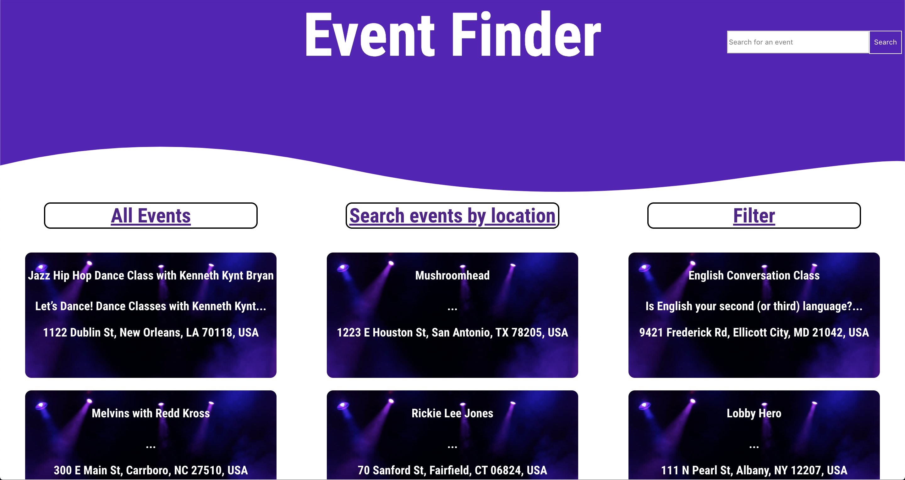
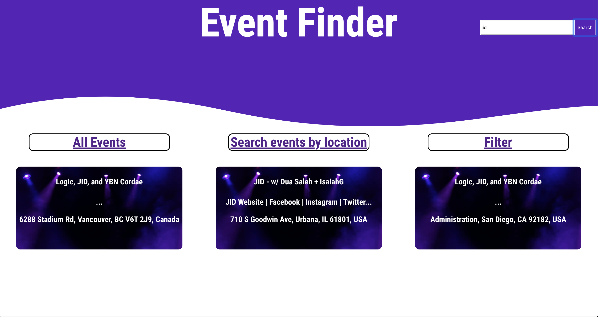
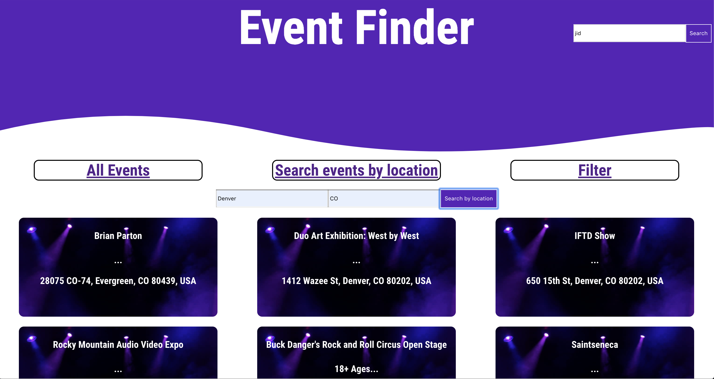
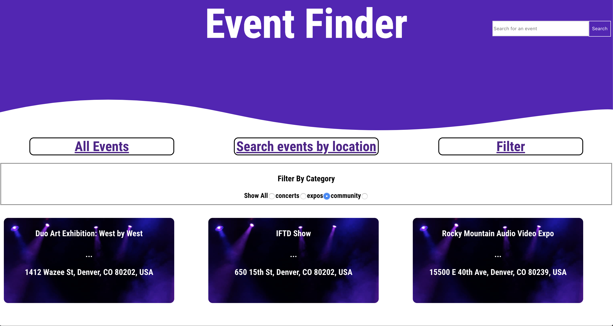

# Tune In Later

Event tracker is an application geared toward the lazy individual who wants to know what events are coming up / going on. While fetching to the PredictHQ API, a user can see 10 upcoming events around the globe. Clicking on the Searching by location tab will allow a more precise representation of events once you pass in a city and state. A user is also able to filter the current set of events based on the category that they fall in. There will be more added to this application in the coming weeks so stay tuned...


## Technologies Utilized
 - React
 - React Router
 - Redux
 - PredictHQ API / Google maps API
 - PropTypes
 - Jest / Enzyme for testing

## Set Up

### Clone and Install UI

Clone down the UI repository.

Install the application's dependencies from within the cloned directory:
```bash
npm install
```

Then launch the application within the browser:
```bash
npm start
```

### Launch API & UI

Now that you've started the application, open [http://localhost:3000](http://localhost:3000) to view in your browser.

## Testing

Application components have been tested using various unit testing techniques including snapshots, class method and functional testing. 
```bash
npm test
```

## Developers
 - Aidan McKay [@JellyBeans1312](https://github.com/JellyBeans1312)
 
 ## Screenshots




